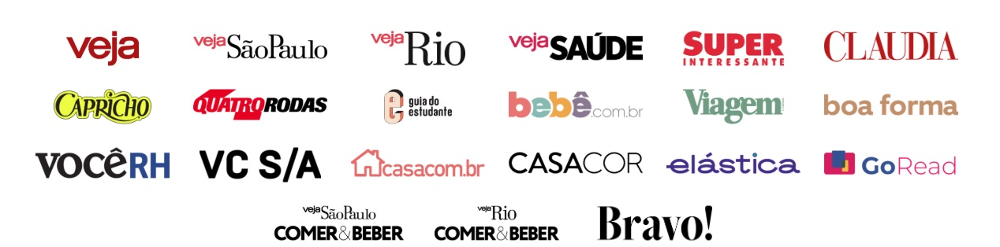

```{r setup, include=FALSE}
options(htmltools.dir.version = FALSE)
knitr::opts_chunk$set(
  fig.width=9, fig.height=3.5, fig.retina=3,
  out.width = "100%",
  cache = FALSE,
  echo = TRUE,
  message = FALSE, 
  warning = FALSE,
  hiline = TRUE
)
library(leaflet)
library(geosphere)

# Criar ícones
icone <- awesomeIcons(
  icon = 'graduation-cap',
  iconColor = 'white',
  library = 'fa',
  markerColor = 'blue'
)

casa <- awesomeIcons(
  icon = 'home',
  iconColor = 'white',
  library = 'fa',
  markerColor = 'green'
)

# Coordenadas
lat1 <- -3.746092
lng1 <- -38.573943

lat2 <- -4.17398
lng2 <- -38.4638

# Distância em km
dist_km <- distHaversine(c(lng1, lat1), c(lng2, lat2)) / 1000
```

```{r xaringan-themer, include=FALSE, warning=FALSE}
library(xaringanthemer)
style_mono_light(base_color = "darkgreen",
                   header_font_google = google_font("Josefin Sans"),
  text_font_google   = google_font("Montserrat", "300", "300i"),
  code_font_google   = google_font("Fira Mono"))
#style_duo_accent(
#  primary_color = "#1381B0",
#  secondary_color = "#FF961C",
#  inverse_header_color = "#FFFFFF"
#)
```

## Ozias Filho
### 📚 Formação Acadêmica  

- 🎓 **Bacharel em Estatística – UFC (2018)** 

--

- Atuei com **Geoestatística** e **Epidemiologia** durante a graduação  

--

- 🎯 **Pós-Graduação em Ciência de Dados – FBUni (2021)** 

--

- Foco em **Processamento de Linguagem Natural (PLN)** 


---
## 🚀 Vamos Começar uma Viagem!


- Uma jornada que vai muito além da estrada.

--

- Bora descobrir onde tudo começou?

--

<div style="text-align: center;">
  
</div>
---

##Onde Estamos (Ponto de Partida)
### Bloco 910 – Campus do Pici / UFC

```{r pici,echo=FALSE,fig.align='center',warning=FALSE}
leaflet() |>
  addTiles() |>
  setView(lng = lng1, lat = lat1, zoom = 13) |>
  addAwesomeMarkers(
    lng = lng1,
    lat = lat1,
    icon = icone,
    popup = "Bloco 910"
  )
```
---
## 🎯 Nosso Destino  
### De Bloco 910 até Pacajus

- Antes de começarmos a história, vamos entender o caminho que eu fazia entre minha cidade e a universidade.

```{r pacajus,echo=FALSE,fig.align='center',fig.height=5.5, out.width="100%",warning=FALSE}
leaflet() |>
  addTiles() |>
  addAwesomeMarkers(
    lng = lng1,
    lat = lat1,
    icon = icone,
    popup = "Bloco 910"
  ) |>
  addAwesomeMarkers(
    lng = lng2,
    lat = lat2,
    icon = casa,
    popup = "Pacajus"
  ) |>
  fitBounds(
    lng1 = min(lng1, lng2),
    lat1 = min(lat1, lat2),
    lng2 = max(lng1, lng2),
    lat2 = max(lat1, lat2)
  )
```
---
## ↔️ Percurso da Jornada  
#### Uma distância de `r round(dist_km, 2)` km... e muitos desafios no caminho.
```{r distancia,echo=FALSE,fig.align='center',fig.height=5.5, out.width="100%",warning=FALSE}
leaflet() |>
  addTiles() |>
  addAwesomeMarkers(
    lng = lng1,
    lat = lat1,
    icon = icone,
    popup = "Faculdade"
  ) |>
  addAwesomeMarkers(
    lng = lng2,
    lat = lat2,
    icon = casa,
    popup = "Pacajus"
  ) |>
  addPolylines(
    lng = c(lng1, lng2),
    lat = c(lat1, lat2),
    color = "red",
    weight = 3,
    opacity = 0.8
  ) |>
  addPopups(
    lng = mean(c(lng1, lng2)),
    lat = mean(c(lat1, lat2)),
    popup = paste0("Distância: ", round(dist_km, 2), " km")
  ) |>
  fitBounds(
    lng1 = min(lng1, lng2),
    lat1 = min(lat1, lat2),
    lng2 = max(lng1, lng2),
    lat2 = max(lat1, lat2)
  )

```
---
### Pacajus
```{r bandeira,echo=FALSE,fig.align='center',fig.height=5.5,out.width="70%"}
knitr::include_graphics("https://upload.wikimedia.org/wikipedia/commons/1/1b/BandeiraPacajus.png")
```
---
### Pacajus
#### 📍 Região Metropolitana de Fortaleza  
- 🌎 Localizada a **50 km de Fortaleza**  

--

- Minha **cidade natal** e onde moro atualmente  

--

#### 👥 População  

- 🏢 **70.983 habitantes** (Censo 2022) 

--

- 📈 **74.825 habitantes** (Estimativa IBGE 2024)  

---
### 🎓 Minha Realidade no Ensino Médio (2011–2013)  

- 🏫 **Escola Pública Estadual**  

--

- 👥 **Salas superlotadas**: entre **50 e 60 alunos**

--

- ⚠️ **Greves em 2011 e 2012**  

--

- ⏸️ **Paralisação dos professores em 2013**  

---
### 🚀 2014 – Ingresso na UFC  
#### Estatística (Sem Saber o Que Era 😅)  

- Área de Exatas  

--

- Totalmente sem ideia do que era Estatística  

--

- Entrei pela **lista de espera** (🚦 Cerca de **15 dias depois** do início do semestre) 

--

> Comecei atrasado... mas logo comecei a correr atrás!

---
### 🤝 2014 – Primeiro Contato com a Prática  
#### Ingresso na **GAUSS – Empresa Júnior de Estatística**  

- 📚 Contato com alunos veteranos

--

- 👨‍💻 Primeiras experiências com a Estatística aplicada

--

- 🚀 Entendi que aprender ia além da sala de aula  

--

> Aqui comecei a perceber o potencial da Estatística.

---
### ⚠️ 2015 – Desafios no Caminho  

- 🛑 **Greve na Universidade** 

--

- 🤝 Entrei no **PET Estatística** (mas saí após **2 meses**)  
  - Motivo: projeto voluntário, não consegui conciliar na época. 

--

> Nem tudo dá certo na primeira tentativa... e tudo bem!

---
### 🔍 2016 – Primeiras Pesquisas Acadêmicas  

- 💼 **Bolsista de Iniciação à Docência (PIBID)** 

--

- 🎯 Monitor **Seminários de Tutoria I e II**  (**Análise Exploratória de Dados**)

--

- 🧑‍🏫 Orientação: Prof. Welliandre  

--

> **Tema:**  [COMPARAÇÃO ENTRE AS OPINIÕES DOS ALUNOS DE ESTATÍSTICA E MATEMÁTICA INDUSTRIAL COM RELAÇÃO AS DISCIPLINAS DE SEMINÁRIO DE TUTORIA I E II](http://periodicos.ufc.br/eu/article/view/16580)

---
### 2017: Novos Desafios, Novas Pesquisas

- 🎯 **Bolsista de Apoio a Projetos da Graduação**  

--

- 👩‍🏫 Orientação: Profª Jacqueline

--

>📄 **Tema:**  [UMA ANÁLISE DA PERMANÊNCIA DOS ALUNOS NO CURSO DE ESTATÍSTICA](http://www.periodicos.ufc.br/eu/article/view/29500)

--

- 📊 Início da coleta de dados do meu **TCC**  

--

> Aqui consolidei o entendimento de que os dados não são apenas números — eles revelam trajetórias, permanências e histórias reais..

---
### 2018: A Conclusão da Graduação


- ✅ Conclusão do curso de Estatística – UFC  

--

- 🦠 **TCC:**

--

> *“Chikungunya: Análise Espacial e Estatística das Ocorrências no Município de Pacajus no ano de 2017”* 

--

- 👨‍🏫 Orientadores: Prof. Júlio Barros e Prof. Gustavo

--

> Um trabalho que uniu minha formação, minha cidade e meu desejo de gerar impacto real através dos dados. 

---

### 💡 Resumo da Graduação  

- 🚧 Tive **reprovações** 

--

- 🎓 Levei **10 semestres** para concluir (esperado: 8)

--

- ⚠️ **O curso é difícil, sim. E tá tudo bem.**  

--

- 🔥 O importante é **NÃO DESISTIR!**  

--

- 🔗 Ter proximidade com os **professores** fez toda diferença  

--

- 📢 Hoje, meu papel é **inspirar e puxar amigos** para o lado da Estatística  

--

- 🔗 [Análise de Dados em 2025: Tendências, Desafios e Oportunidades](https://gaiasec.com.br/analise-de-dados-em-2025-tendencias-desafios-e-oportunidades/)

--

- 🔗 [A Importância da Estatística - Inglês](https://www.mtu.edu/globalcampus/degrees/graduate/applied-statistics/articles/importanceofstats/)

--

- 🔗 [2021 – Estatística no Topo das Melhores Oportunidades](http://www.conre3.org.br/portal/em-2021-estatistico-continua-no-topo-das-melhores-oportunidades/?fbclid=IwAR023nTfoGUco7HmsosrxL-5vP6qbiOmfqel_zLYIR4Fvaf0tZixzQz0VBk)

--
---
### 🚀 2019 – Primeiros passos na Carreira  

- 🏢 **Sistema Verdes Mares (SVM)** 

--

- 📰 **Jornalismo de Dados** – Núcleo de Dados do SVM  

```{r logo svm,echo=FALSE,fig.align='center', out.width='40%'}
knitr::include_graphics("https://upload.wikimedia.org/wikipedia/commons/d/de/SVM_LOGO_COMPLETO.png")
```
--

- 💼 Atuei em +100 reportagens (2019, 2020, 2021)

--

- 🎓 Início da Pós-Graduação em **Ciência de Dados – FB UNI**  

```{r logo fb,echo=FALSE,fig.align='center', out.width='40%'}
knitr::include_graphics("https://cdn.fbuni.edu.br/assets/img/logo-fbuni-color.png")
```
---
### Algumas Reportagens de Destaque
#### 📰 Reportagens em que atuei 

- [Ceará tem o menor repasse federal de convênios em cinco anos](https://diariodonordeste.verdesmares.com.br/politica/ceara-tem-o-menor-repasse-federal-de-convenios-em-cinco-anos-1.2106958)

- [Geração de emprego alcança apenas jovens de até 29 anos no Ceará](https://diariodonordeste.verdesmares.com.br/negocios/geracao-de-emprego-alcanca-apenas-jovens-de-ate-29-anos-no-ceara-1.2206585)

- [Homicídios crescem em todas as regiões do Ceará neste ano](https://diariodonordeste.verdesmares.com.br/seguranca/homicidios-crescem-em-todas-as-regioes-do-ceara-neste-ano-1.2968337)

- [Direito à Informação: 89% dos municípios do Ceará não cumprem a Lei de Acesso à Informação](https://diariodonordeste.verdesmares.com.br/politica/direito-a-informacao-89-dos-municipios-do-ceara-nao-cumprem-a-lei-de-acesso-a-informacao-1.2995201)

- [Candidatos recebem recursos públicos e têm zero voto no Ceará](https://diariodonordeste.verdesmares.com.br/politica/candidatos-recebem-recursos-publicos-e-tem-zero-voto-no-ceara-1.3013918)

- [Com home office, deputados federais do Ceará poupam R$ 3 milhões em verba pública](https://diariodonordeste.verdesmares.com.br/politica/com-home-office-deputados-federais-do-ceara-poupam-r-3-milhoes-em-verba-publica-veja-gastos-1.3035953)

---
### Produções Individuais
#### 🧠 Projetos e Análises Próprias  

- [Eleições Municipais](https://medium.com/@oziasfilho15/an%C3%A1lise-das-elei%C3%A7%C3%B5es-municipais-de-pacajus-ce-em-2020-40f52fccdac8)

--

- [Web-Scraping Letras.mus e WordCloud](https://oziasfilho15.medium.com/nuvem-de-palavras-da-banda-resgate-892f8b84871b)

--

- [Web-Scraping IMDb — The Office](https://oziasfilho15.medium.com/web-scraping-imdb-the-office-c6d47279922a)

--

> Dados estão em tudo. Inclusive na sua série favorita ou nas suas músicas!

---
###2021: Grandes Mudanças

- 🔚 **Saída do SVM** 

--

- 🎓 **Conclusão da Pós-Graduação**  
🧠 TCC:  
> *"Extração Automática de Palavras-Chave em Notícias do Diário do Nordeste"*  

--

### 🚀 Novo desafio:  
**Cientista de Dados Jr. – Grupo Abril**  

```{r,echo=FALSE,fig.align='center',out.width="60%"}

```
---
### Grupo Abril

```{r,echo=FALSE,fig.align='center'}

```
--

- Diretoria de Data Intelligence

--

- Análise de Audiência Digital (Web Analytics)

### Algumas Participações
<div style="column-count: 2; column-gap: 2rem;">
--

- Radar Econômico

--

- Otimização de Investimentos nas Redes Sociais

--

- Acompanhamento de KPIs de audiência

--

> Dados transformando decisões de grandes marcas.

---
### 2023: Evolução no Grupo Abril
#### 🚀 Crescimento na Carreira 

- 📈 **Promoção:** Analista de Dados

--

- 🔄 **Mudança de Time:** Squad de Dados

--

###🔧 **Novas Atividades:**  

- ⚙️ **Automatização e Otimização de Queries** no **BigQuery**  

--

- 📊 **Previsão da Meta de Audiência Anual**  

--

- 🔍 **Análise de performance de matérias no Google Discover**  

--

- 🤝 **Mentoria e Apoio aos Analistas de Dados Jr.**  

--

> Crescimento não é só técnico. É também sobre ajudar quem está chegando!  

---

### Ferramentas do Meu Dia a Dia

```{r,echo=FALSE,fig.align='center', out.width='60%'}

```

--

> Não se apaixonem pelas ferramentas. Se apaixonem pelos problemas que vocês podem resolver com elas!


---
### 📞 Contatos

- 📧 Email: <a href="mailto:oziasfilho15@gmail.com">oziasfilho15@gmail.com</a>  
- 💼 LinkedIn: <a href="https://www.linkedin.com/in/oziasfilho/">Ozias Filho</a>  

--

> *"Porque Deus amou o mundo de tal maneira que deu o seu Filho unigênito,  
para que todo aquele que nele crê não pereça, mas tenha a vida eterna."*  
> — João 3:16

--

### 🙏 Obrigado!

--

> *"Tudo o que você tiver de fazer, faça o melhor que puder."*  
> — Eclesiastes 9:10a

--

Os slides foram criados com os pacotes do R:  
[**xaringan**](https://github.com/yihui/xaringan) e  
[gadenbuie/xaringanthemer](https://github.com/gadenbuie/xaringanthemer)
